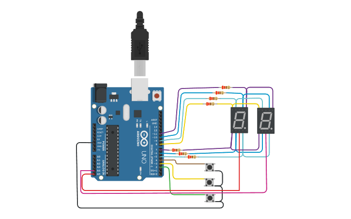
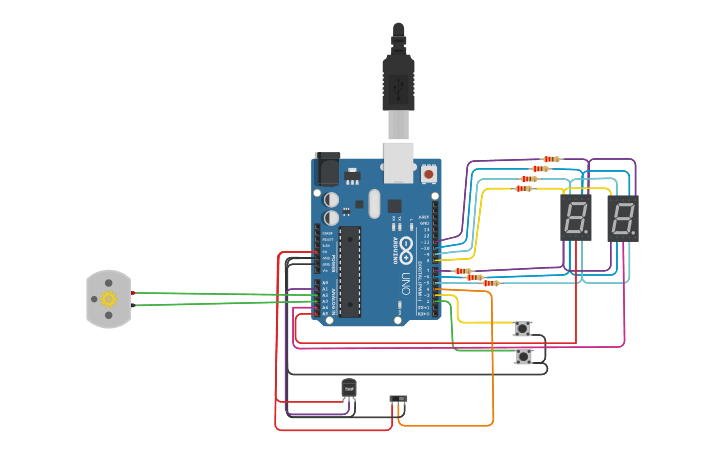
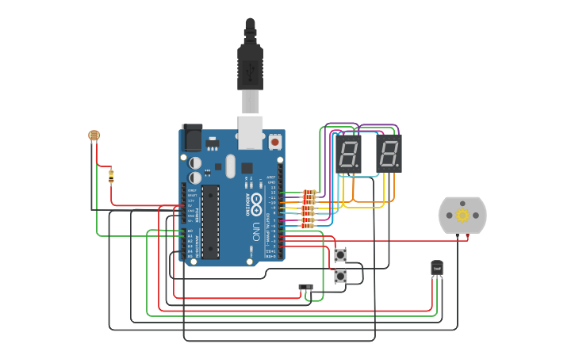

# Parcial SPD 

## Integrantes 
- Facundo Chiappa
- Agustin Carmona
- Felipe Sznec
- Luz Cartolano

## Profesor:
- Dario Cuda
- Esteban Quiroz (tutor)

## Proyecto: Contador binario con multiplexacion.

## Proyecto: Contador binario con multiplexacion, switch de numeros primos, motor y sensor de temperatura.

## Proyecto: Contador binario con multiplexacion, switch de numeros primos, motor, sensor de temperatura y sensor de luz ambiental.

## Descripción
Realizamos un contador que va de 0 a 99 a traves de dos Displays de 7 segmentos 
utilizando el metodo de multiplexacion para controlar cada display independientemente
debido a que estos estaban conectados en paralelo. A su vez, añadimos la funcionalidad
de 3 botones los cuales tenian cada uno un funcionamiento distinto, un boton aumentaba
la cuenta, el otro restaba la cuenta y por ultimo el tercer boton reiniciaba el contador 
a su estado original, es decir, a 00.
Luego uno de los botones (el de reset), se convierte en un switch deslizable el cual 
al estar del lado izquierdo, muestra la cuenta de numeros solo mostrando los numeros primos y al estar
del lazo derecho, muestra la cuenta en su estado original (de uno en uno).
Tambien agregamos un sensor de temperatura el cual ayudaba a controlar el motor, como tambien un sensor
de luz ambiental. Su funcion era controlar la intensidad de movimiento del motor usando las variables del sensor de temperatura y de luz para asi poder controlar la velocidad del motor, es decir, sus rpm (revoluciones por minuto).

## :robot: Link al proyecto 1
- [proyecto](https://www.tinkercad.com/things/iyHLEff0hUF)

## :robot: Link al proyecto 2
- [proyecto](https://www.tinkercad.com/things/708WoyHEdIP)

## :robot: Link al proyecto 3
- [proyecto](https://www.tinkercad.com/things/72ArPFh2wpp)
